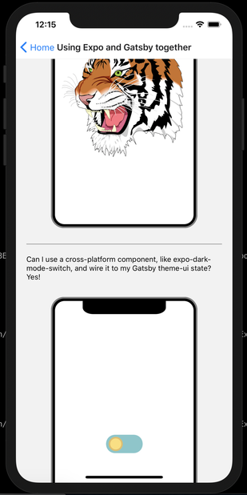

This post will try to incite you to get started with cross-platform development, starting from your own Gatsby blog.

You probably heard of [React-Native-Web](https://github.com/necolas/react-native-web), permitting to render React-Native views on the web. So, why not on a static website?

I'll show that it's possible (and actually pretty easy) to embed runnable React-Native code inside a Gatsby blog post. I really hope all React-Native developers owning a Gatsby blog will do so. You will find demos and code samples at the end.


------------------------------------------------

# The state of cross-platform in 2020

React-Native now has a [lean core](https://github.com/facebook/react-native/issues/23313). Somehow, [Expo](https://expo.io/) can be seen as an extension of the React-Native SDK: it offers a much larger API surface, enabling richer experiences.

These last years, Expo (particularly [Evan Bacon](https://twitter.com/baconbrix)) has done a great work to bring support for web to many of its APIs, and new APIs tend to be crafted with the web platform in mind.
Expo created [@expo/webpack-config](@expo/webpack-config), a default Webpack config that enables you to get started with React-Native-Web ASAP (without configuring babel loader, enabling the `.web.js` extension, adding svg support...).

It's also worth mentioning that Microsoft is developing [React-Native for Windows and MacOS](https://microsoft.github.io/react-native-windows/), and actively collaborate with Facebook. New React-Native abstractions also try to take into consideration desktop applications.
They also work [ReactXP](https://microsoft.github.io/reactxp/), an alternative solution to React-Native-Web, with a smaller and reworked API surface (only 11 primitive components).
That wouldn't surprise me to see Facebook/Microsoft to come up with a new mobile OS, running React-Native natively (it could run all existing apps for free, with minor adaptations, and with better performance than iOS/Android). That could explain why Microsoft invests in React-Native for MacOS, as it gives more incentives for developers to use React-Native, and bring desktop support to it.

Flutter is also very interesting, but they have an even larger ecosystem to build to succeed, while React-Native can more easily reuse existing JS tooling. For example, it's unlikely to see this year a static site generators in Dart at the level of Gatsby or NextJS. Being able to render an UI is not the whole story, to enable enterprise production-ready Flutter on the web, they'll also have to tackle the distribution/packaging of apps.

The future of cross-platform development looks bright to me. For Windows and Mac, it's a bit early, but it's really time to adopt cross-platform for the web.

------------------------------------------------


# React-Native, Expo and Gatsby

I'm the maintainer of [gatsby-plugin-react-native-web](https://github.com/slorber/gatsby-plugin-react-native-web), and pleased to announce the **version 3.0 is now out of beta**, and uses under the hood `@expo/webpack-config`.
This means you basically just need to add the plugin to `gatsby-config.js`, and **nothing else is required** to get started (there's not even a config object for this plugin to work). If you tried former versions, you should consider trying again with this one.

Your favorite ReactNative libs and UI kits should work out of the box.
There might still be a few edge cases (please report them), but I'm confident it's now ready for massive adoption.


------------------------------------------------


# Call to action


### You are a React-Native, Expo developer?


It's time to embed some real, runnable React-Native code in your blog posts. And yes, it works with [MDX](https://github.com/mdx-js/mdx), with a Gatsby theme (like [mine](https://github.com/narative/gatsby-theme-novela)!), with [Docz](https://www.docz.site/)...

You can do this with [NextJS](https://dev.to/evanbacon/next-js-expo-and-react-native-for-web-3kd9) too. [Evanbacon.dev](http://evanbacon.dev/) is build with NextJS and Expo. But really, you can use [@expo/webpack-config](https://www.npmjs.com/package/@expo/webpack-config) anywhere there is webpack.

If you have an Expo app, it's also time to try the `expo build --web` command.
This is certainly the easiest to get started, but we haven't really figured out a good cross-platform navigation system. React-Navigation might support web, but mobile and desktop navigation patterns are simply different beasts, and it's hard to find a good abstraction.


### You are a web developer?

I still encourage you to try this plugin, just to get a better idea about what React-Native-Web is.

In case you don't aim to share code between web and mobile, React-Native-Web can be seen as a low-level UI kit, including its own performant CSS-in-JS system, with a few interesting specificities like [atomic CSS](http://necolas.github.io/react-native-web/docs/?path=/docs/guides-style--page#implementation-details).
It's so good, that Twitter choose to use this for their mobile and desktop websites, despite they don't even use ReactNative on mobile.
Facebook also hired React-Native-Web author [Nicolas Gallagher](https://twitter.com/necolas), and the new Facebook (in beta), is using a proprietary/unreleased atomic CSS framework (XStyle?).
This atomic CSS strategy has been reported to scale extremely well for large websites (see this [React Conf 2019 keynote](https://www.youtube.com/watch?v=9JZHodNR184)).

It has also been speculated that [React-Native might simply become a better choice for building websites than React-DOM](https://www.swyx.io/writing/react-native-web-singularity/). I don't think it's the case today though, but globally share this idea.


### You are a lib author?

It's time to seriously think about cross-platform development.
What if your lib could be used everywhere, instead of just the web OR mobile?

Apart from Expo, React-Native core, and a few React-Native UI kits, there is a lack of quality cross-platform components for rich experiences (toasts, maps, credit card inputs...).
[expo-dark-mode-switch](https://github.com/EvanBacon/expo-dark-mode-switch) is a good cross-platform component example. Using [expo-module-scripts](https://www.npmjs.com/package/expo-module-scripts) might help you publish something.

Publishing cross-platform  libraries might become as important for consumers as publishing a library with type definitions.
Think about how annoying it is when you want to use a JS library but find out it does not have TypeScript defitions?
Or when you want to use a JS library in Node, but find out it unnecessarily depends on some global browser object? In the future, not publishing cross-platform React widgets might create the same level of frustration. I think it's time to make the cross-platform ecosystem great, and the Expo team show us the way.


------------------------------------------------


# Demo time

These demos may not look very impressive, but keep in mind they are all written with React-Native and Expo components / apis.
There's no usage of a single `div` in the codebase here, nor any DOM usage.
All these demos can also run in iOS and Android (natively of course).

**Warning**: the web support of available cross-platform components might be a bit rough (usage is not really mainstream...). I can't guarantee all demos work in all browsers, and you'd rather try with Chrome.

import {
  ExpoCameraDemo,
  ExpoDarkModeSwitchDemo,
  ExpoBatteryDemo,
  ExpoGesturesDemo,
  ExpoSvgDemo,
  ExpoVideoDemo,
  ExpoImagePickerDemo,
} from './components';


------------------------------------------------

So, let's start with a simple one.
Can I display the battery of your computer? Yes!

<ExpoBatteryDemo />

------------------------------------------------


Can I render a complex svg with react-native-svg? Yes!

<ExpoSvgDemo />


------------------------------------------------


Can I use a cross-platform component, like [expo-dark-mode-switch](https://github.com/EvanBacon/expo-dark-mode-switch), and wire it to my Gatsby theme-ui state? Yes!

<ExpoDarkModeSwitchDemo />

------------------------------------------------


Can I ask your permission to use your camera, and reveal it with a fade-in animation? Yes!

<ExpoCameraDemo />

------------------------------------------------


Can I use more complex gesture-based systems? Yes!

<ExpoGesturesDemo />


Can I play a video? Yes!

<ExpoVideoDemo />

------------------------------------------------


Can I build an image picker, and enable a few image transformations? Yes!

<ExpoImagePickerDemo />

------------------------------------------------

In case you wonder what the code looks like, here's a snippet for the camera demo.

You can find the rest of the code [here](https://github.com/slorber/sebastienlorber.com/tree/master/content/posts/2020-04-21-using-expo-and-gatsby-together).

```jsx
import { View, Text } from 'react-native';
import { Camera } from 'expo-camera';
import * as Permissions from 'expo-permissions';

import MobilePhoneView from 'components/MobilePhoneView';
import AppButton from 'components/designSystem/AppButton';
import AppRevealView from 'components/designSystem/AppRevealView';

export const ExpoCameraDemo = () => {
  const [showCamera, setShowCamera] = useState(false);
  return (
    <MobilePhoneView safeAreaPaddingTop={0}>
      {showCamera ? (
        <AppRevealView>
          <Camera style={{ flex: 1, width: '100%' }} />
        </AppRevealView>
      ) : (
        <View style={{ flex: 1, justifyContent: 'center' }}>
          <AppButton
            onPress={async () => {
              const result = await Permissions.askAsync(Permissions.CAMERA);
              if (result.status === 'granted') {
                setShowCamera(true);
              }
            }}
          >
            Show expo-camera
          </AppButton>
        </View>
      )}
    </MobilePhoneView>
  );
};
```

------------------------------------------------


I hope this post helps you understand that cross-platform works fine for various kind of experiences, and there are very few things that you can't do in a cross-platform way today. Let's build more of these!

I'll update this post regularly, if I find new interesting cross-platform experiences (feel free to give me ideas).

------------------------------------------------


# Toward cross-platform MDX content authoring

All these demos use React Native and Expo code, and they can run natively on React-Native.
These demos are embedded in this markdown post using [MDX](https://github.com/mdx-js/mdx).
Fortunately, MDX can be run on React-Native too!

This actually means that... **my posts are cross-platform**?

Stay tuned: in upcoming blog posts, I'll show you how I run my MDX blog posts inside an Expo app.



For a preview, scan my [Expo QRCode](https://expo.io/@slorber/sebastien-lorber), or take a look at the [source code](https://github.com/slorber/sebastienlorber.com) :)


------------------------------------------------

Thank you for reading!

------------------------------------------------


If you like it, spread the word with a [Retweet]()

Browser code demos, or correct my post typos [on the blog repo](https://github.com/slorber/sebastienlorber.com/tree/master/content/posts/2020-04-21-using-expo-and-gatsby-together)

For more content like this, subscribe to [my mailing list](https://mailchi.mp/4ea4df0b54f7/sebastienlorber) and follow me on [Twitter](https://twitter.com/sebastienlorber).
