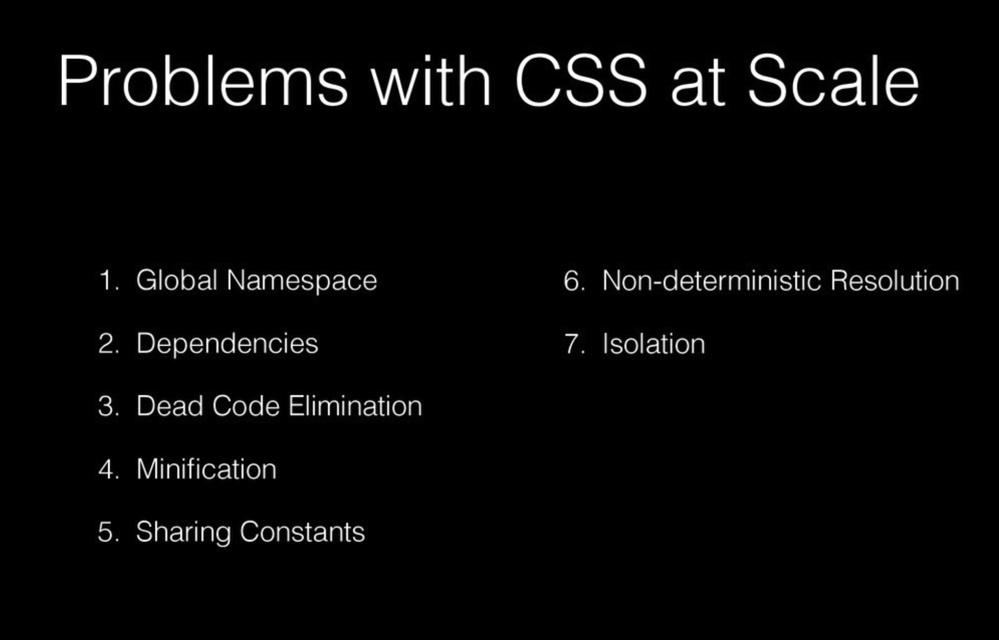
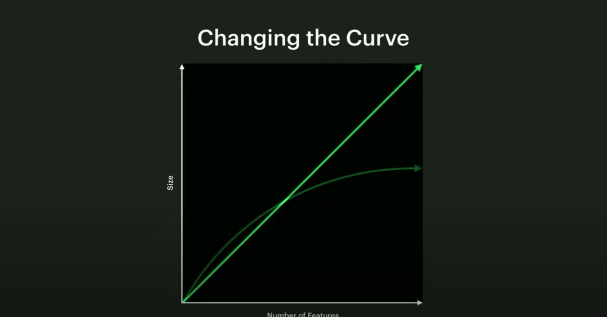
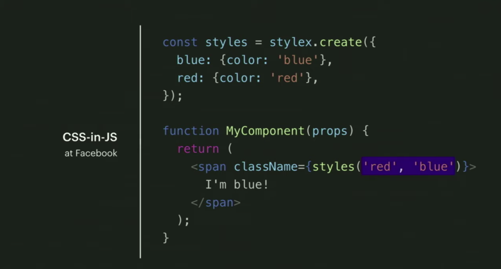
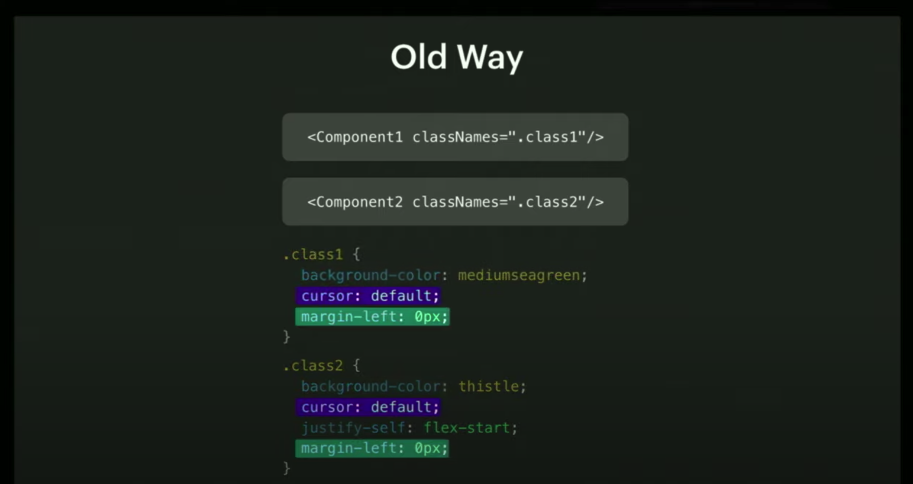
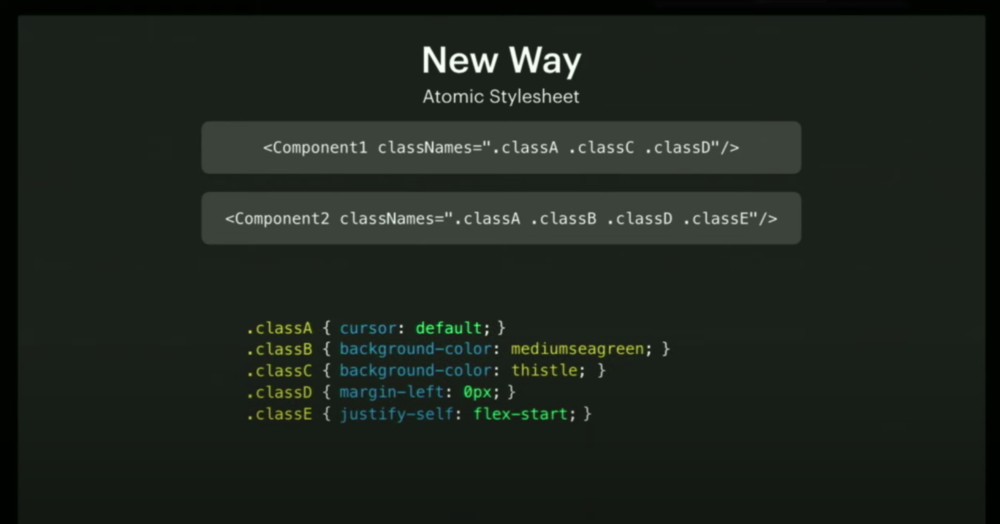
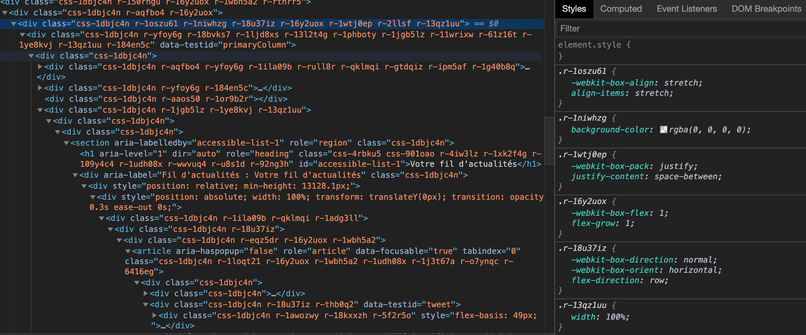
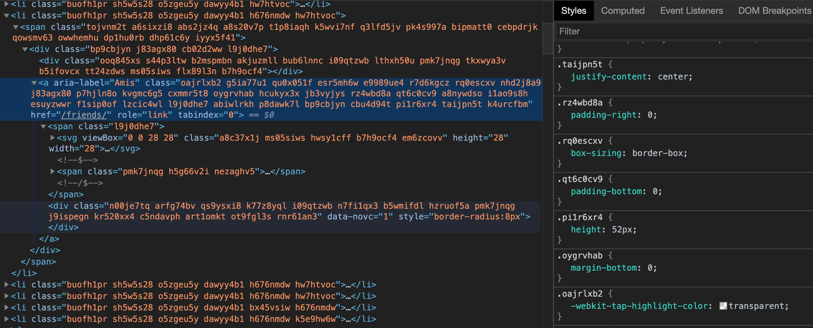
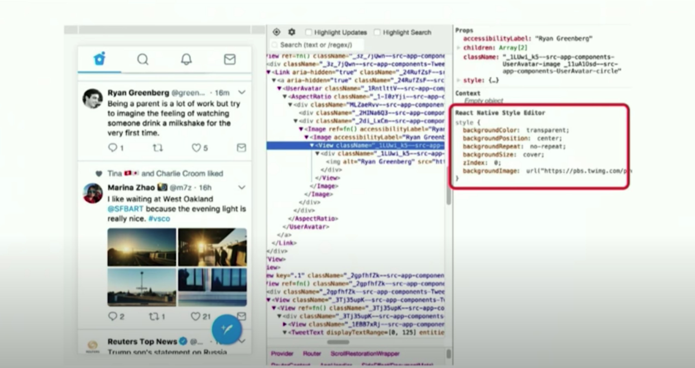
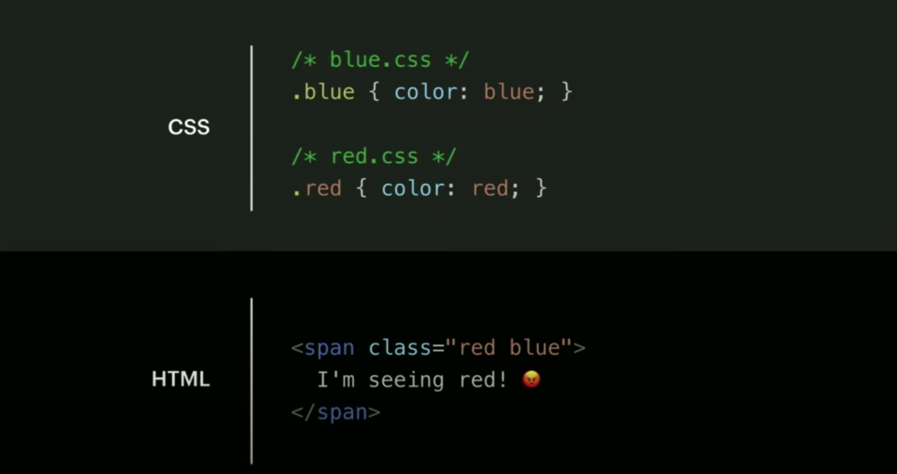

With recent production deployments from Facebook and Twitter, I think a new trend is slowly growing: atomic CSS-in-JS.

In this post, we'll see what atomic CSS is, how it relates to functional / utility-first CSS like TailwindCSS, and that big players are adopting it in their modern React codebases.

As I'm not a expert of this subject, don't expect a deep dive about the pros and cons. I just hope you get an idea about what it's about.

**Note**: Atomic CSS is not really related to [Atomic Design](https://atomicdesign.bradfrost.com/).


---

import {SubscribeFormAside} from 'components/SubscribeForm';

<SubscribeFormAside>

  Before getting started, subscribe to **[This Week In React](https://thisweekinreact.com)** 😜<br/>
  A weekly newsletter to stay up-to-date with React & React-Native 👌

</SubscribeFormAside>


----------------------------------------------------

# What is atomic CSS?

You may have heard of various CSS methodologies like BEM, OOCSS...

```html
<button class="button button--state-danger">
	Danger button
</button>
```

These days, people really like [Tailwind CSS](https://tailwindcss.com/) and its [utility-first](https://tailwindcss.com/docs/utility-first/) concept. This is close to Functional CSS and [Tachyon](https://github.com/tachyons-css/tachyons).

```html
<button class="bg-blue-500 hover:bg-blue-700 text-white font-bold py-2 px-4 rounded">
  Button
</button>
```

With a stylesheet of a bunch of utility classes, you can go a long way.

Atomic CSS is like an extreme version of utility-first CSS: all CSS classes have a single, unique CSS rule.
`Atomic CSS` was first used by Thierry Koblentz (Yahoo!), in [Challenging CSS Best Practices](https://www.smashingmagazine.com/2013/10/challenging-css-best-practices-atomic-approach/) in 2013.

```css
/* Atomic CSS */
.bw-2x {
  border-width: 2px;
}
.bss {
  border-style: solid;
}
.sans {
  font-style: sans-serif;
}
.p-1x {
  padding: 10px;
}


/* Not atomic, because the class contains 2 rules */
.p-1x-sans {
  padding: 10px;
  font-style: sans-serif;
}
```


With utility/atomic CSS, we acknowledge it's ok to couple the structure and presentation layers: when we need to change the button color, we modify the HTML, not the CSS.
This tight coupling is also acknowledged in modern CSS-in-JS React codebases, but it seems the CSS world figured out first that the "separation of concern" of the web didn't feel right.

Specificity is also less a problem, as we use simple class selectors.

We are now styling via the markup, which has several interesting properties:
- the stylesheet grows less as we add new features
- we can move the markup around, and the styles are moved at the same time
- we can remove features, and be sure that we remove the related styling at the same time

For sure, the html is a bit more bloated.
This can be a concern for server rendered web apps, but the high redundancy in class names compress well with gzip, in the same way it worked well for duplicated css rules previously found in your CSS files.

You don't need to use utility/atomic CSS for every cases, just the most common styling patterns.

Once your utility/atomic CSS is ready, it will not change or grow much.
It's possible to cache it more aggressively (you can append it to `vendor.css` for example, and expect it to not invalidate across app redeploys).
It is also quite portable, and you can use it in other applications.


----------------------------------------------------

# Limits of utility/atomic CSS

Utility/atomic CSS looks interesting, but they come with a few challenges as well.

People usually write utility/atomic CSS by hand, carefully crafting naming conventions.
It can be hard to ensure the convention is easy to use, consistent, and not bloated over time.
Can multiple persons work on this CSS and keep it consistent?
Is it subject to the [bus factor](https://en.wikipedia.org/wiki/Bus_factor)?

You also need to work on a good utility/atomic stylesheet up-front, before being able to iterate on features that will use it.

If the utility/atomic CSS is made by someone else, you will have to learn the class naming conventions first (even if you know everything about CSS).
This convention is opiniated, and it's possible that you don't like it.

Sometimes, you need some extra CSS that is not provided by your utility/atomic CSS.
There's no unique way to provide the remaining one-off styles.


----------------------------------------------------

# Tailwind to the rescue

The approach of Tailwind is very convenient, and solves some of these problems.

It does not really provide a unique utility CSS file for all websites. Instead, it only provides a shared scope and naming conventions. From a [configuration](https://tailwindcss.com/docs/configuration/) file, it allows you to generate your own custom utility CSS.

Knowledge of Tailwind is portable to other applications, even if they don't use exactly the same class names. It reminds me a bit of the "Learn once, write anywhere" philosophy of React.

I've seen people reporting that Tailwind classes cover something between 90% or 95% of their needs. It seems the scope is large enough, and we don't often need to use one-off style.

At this point you might wonder `why use atomic CSS instead of Tailwind?`.
What would you gain in enforcing the atomic CSS rule of `1 rule, 1 class`?
You would end up with a larger html markup, and a less convenient naming convention?
Tailwind already has many atomic classes anyway.

So, should we abandon the idea of atomic CSS, and simply use Tailwind?

Tailwind is a great solution, but there are still a few problems that remain unsolved:
- the need to learn an opiniated naming convention
- CSS rules insertion order still matters
- can unused rules be easily removed?
- what do we do with the remaining one-off styles?

Handwritten atomic CSS might not be the most convenient compared to Tailwind.


----------------------------------------------------

# Comparison with CSS-in-JS

There's a relationship with CSS-in-JS, and utility/atomic CSS. Both approaches advocate for styling from the markup, somehow trying to emulate performant inline styles, which gives them many similar properties (like the ability to move things around with confidence).

[Christopher Chedeau](https://twitter.com/vjeux) greatly helped spread the idea of CSS-in-JS in the React ecosystem. In [multiple](https://speakerdeck.com/vjeux/react-css-in-js) [talks](https://speakerdeck.com/vjeux/react-css-in-js-react-france-meetup), he explains the problems of CSS:



Utility/atomic CSS solve some of these problems too, but definitively not all (particularly, the non-deterministic resolution of styles).

If they share similarities, can't we use them both together?


----------------------------------------------------

# Enter atomic CSS-in-JS

Atomic CSS-in-JS can be seen as "automatic atomic CSS":
- You don't need to create a class name convention anymore
- Common and one-off styles are treated the same way
- Ability extract the critical CSS of a page, and do code-splitting
- An opportunity to fix the CSS rules insertion order issues in JS

I'm not aware about all CSS-in-JS libraries out there currently supporting atomic CSS. Supporting it is actually an implementation detail of the CSS-in-JS library. Support might come and go, or can even be made optional.

I will highlight 2 particular solutions, that recently lead to 2 large-scale atomic CSS-in-JS deployments, using 2 talks as sources:
- React-Native-Web at Twitter (more details in [Nicolas Gallagher's talk](https://www.youtube.com/watch?v=tFFn39lLO-U))
- Stylex at Facebook (more details in [Frank Yan's talk](https://www.youtube.com/watch?v=9JZHodNR184))

See also:
- [Styletron](https://www.styletron.org/)
- [Fela](https://github.com/robinweser/fela)
- [Style-Sheet](https://github.com/giuseppeg/style-sheet)
- [cxs](https://github.com/cxs-css/cxs/)
- [otion](https://github.com/kripod/otion)
- [css-zero](https://github.com/CraigCav/css-zero)
- [ui-box](https://github.com/segmentio/ui-box)
- [style9](https://github.com/johanholmerin/style9)
- [stitches](https://github.com/christianalfoni/stitches)
- [catom](https://github.com/Hydrophobefireman/catom)
- [compiled](https://github.com/atlassian-labs/compiled)

Feel free to [ping me](https://twitter.com/sebastienlorber) if you want to be in the list.

### React-Native-Web

React-Native-Web is a very interesting library: it permits to render React-Native primitives on the web. We are not really talking about cross-platform mobile/web development here (watch the talks for more details).

As a web developer, you just need to understand that React-Native-Web is a regular CSS-in-JS library, that comes with a small set of primitive React components.
Wherever you see `View`, you can replace it in your mind with `div`, and you are good to go.

React-Native-Web has been created by [Nicolas Gallagher](https://mobile.twitter.com/necolas), working on Twitter mobile. They progressively deployed it to mobile, not sure when exactly but probably around 2017/2018.
Since then, it has been used by other companies (Major League Soccer, Flipkart, Uber, The Times...), but the most significant deployment has been the new 2019 Twitter desktop app by a team lead by [Paul Armstrong](https://mobile.twitter.com/paularmstrong).


### Stylex

Stylex is a new CSS-in-JS library developed at Facebook for the 2020 Facebook rewrite (currently in beta). It seems they plan to open-source it some day, possibly under a different name.

It's worth mentioning that Nicolas Gallagher, the author of React-Native-Web, was hired by Facebook 2 years ago. It's not a big surprise to see some of its concept being reused by Facebook.

Unlike React-Native-Web, Stylex does not seem focused on cross-platform development.

All the infos I have are from the talk :) We'll have to wait for more details.


## Scalability

As expected with atomic CSS, both Twitter and Facebook have seen a massive reduction of their CSS, as it now follows a logarithmic curve. There's an initial price to pay for simple apps though.





Facebook shared concrete numbers:
- Their old site was 413Kb of CSS just for the landing page
- Their new site is 74Kb for the **whole site**, including the dark mode


## Source and output

The 2 libraries seems to have a similar and quite simple API, but it's hard to say, considering we don't know much about Stylex.

It's worth highlighting React-Native-Web will expand the CSS shortand syntaxes like `margin: 0`.









## Production inspection

Let's look at what the markup looks like on Twitter:



Now, let's look at the new Facebook:



Many people will probably be horrified when seeing this, but it actually works, and remains [accessible](https://github.com/necolas/react-native-web/blob/master/packages/docs/src/guides/accessibility.stories.mdx).

It might be a bit harder to navigate styles in the Chrome inspector, but devtools can help:



## CSS rules order

Unlike handwritten utility/atomic CSS, the JS libs are able to make the styling not dependent of the CSS rules insertion order.
As you may know, in case of conflicting rules, it's not the last class of a class attribute that wins, but the rule that is inserted last in the stylesheet. Specificity issues are solved by only using simple class-based selectors.




In practice, these libraries avoid outputting classes with conflicting rules on the same element.
They ensure that the last style declared in the markup always wins.
The "overridden classes" are filtered, and don't even make it to the DOM.

```jsx
const styles = pseudoLib.create({
  red: {color: "red"},
  blue: {color: "blue"},
});

// That div only will have a single atomic class (not 2!), for the blue color
<div style={[styles.red, styles.blue]}>
  Always blue!
</div>

// That div only will have a single atomic class (not 2!), for the red color
<div style={[styles.blue, styles.red]}>
  Always red!
</div>
```


**Note**: This predictable behavior is only possible thanks to using the most strict atomic CSS.

If a class had multiple rules, and only one of them was overridden, the CSS-in-JS library wouldn't be able to filter that class without removing the non-overridden rules as well.

If a class had a single shorthand rule like `margin: 0`, and the override was `marginTop: 10`, it's the same problem. The shorthand syntax like `margin: 0` is expanded to 4 distinct classes, and the library is able to filter overridden classes that should not appear in the DOM with more granularity.


----------------------------------------------------

# You still prefer Tailwind?

Once you know all the Tailwind naming conventions, you can code an UI very fast. It might feel less productive to go back to writing every CSS rule by hand, like you do in CSS-in-JS.

Nothing prevents you for building your own abstractions on top of an atomic CSS-in-JS framework. [Styled-system](https://styled-system.com/) might be able to run some of the CSS-in-JS libraries supporting atomic CSS. It's even possible to reuse naming conventions for Tailwind in JS, if you feel you are productive with it.


Let's take some Tailwind code:

```jsx
<div className="absolute inset-0 p-4 bg-blue-500" />
```

Now, let's take a random solution ([react-native-web-tailwindcss](https://www.npmjs.com/package/react-native-web-tailwindcss)) I just found on google:

```jsx
import {t} from 'react-native-tailwindcss';

<View style={[t.absolute, t.inset0, t.p4, t.bgBlue500]} />
```

In term of productivity, this is not very different. And you could avoid typos with TypeScript.


----------------------------------------------------

# Conclusion

That's almost everything I have to say about atomic CSS-in-JS.

I have never used atomic CSS, atomic CSS-in-JS, or Tailwind in any large production deployment. I'm probably wrong on some parts, feel free to correct me on [Twitter](https://twitter.com/sebastienlorber).

I think atomic CSS-in-JS is a trend to watch in the React ecosystem, and I hope you learned something useful with this post.

As I've not been able to find any article about atomic CSS-in-JS, I wrote this mostly for myself.
I want a resource to link to when I mention atomic CSS-in-JS in upcoming blog posts (I plan to write more articles about React-Native-Web and cross-platform, stay tuned).

Thank you for reading.

------------------------------------------------


If you like it, spread the word with a [Retweet](https://twitter.com/sebastienlorber/status/1254822255164567552)

Browser code demos, or correct my post typos [on the blog repo](https://github.com/slorber/sebastienlorber.com/tree/master/content/posts/2020-04-27-atomic-css-in-js)

For more content like this, subscribe to [This Week In React](https://thisweekinreact.com) and follow me on [Twitter](https://twitter.com/sebastienlorber).
