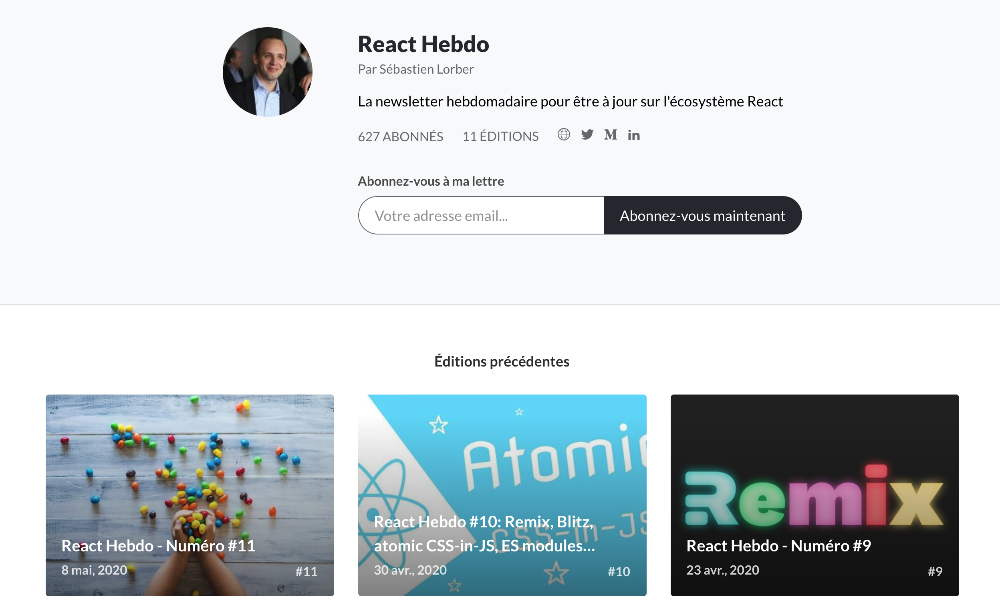
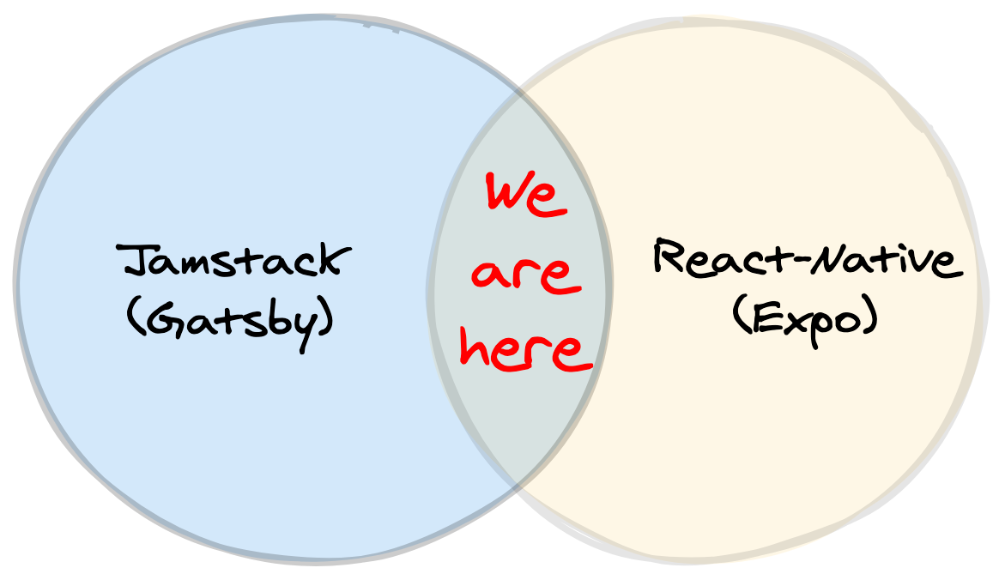
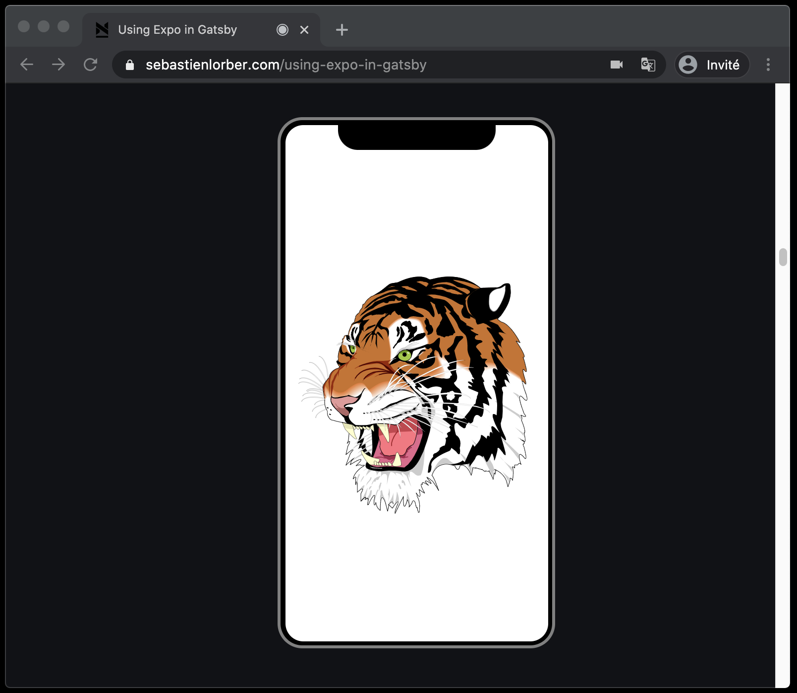
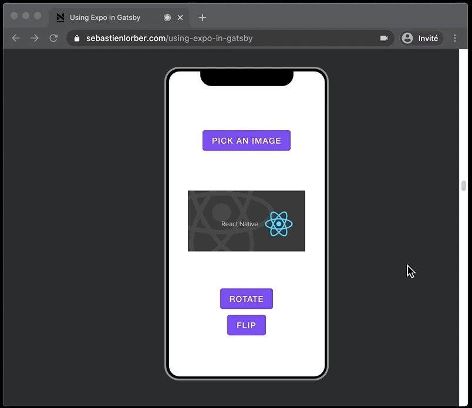
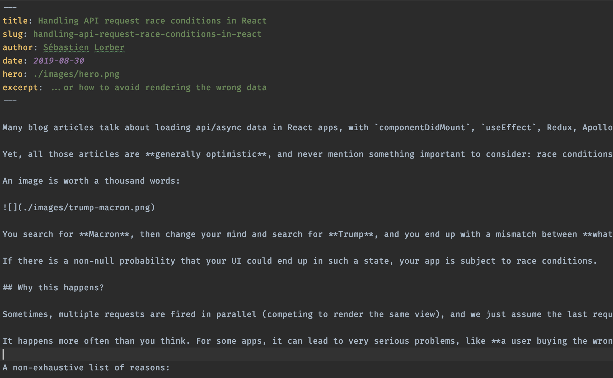

# Cross-platform:

## React-Native, Jamstack, et bien plus...


<br />

### [@sebastienlorber](https://twitter.com/sebastienlorber) - [sebastienlorber.com](https://sebastienlorber.com)

---

# Docusaurus


- Freelance pour Facebook

- Framework de doc Jamstack

- React-Native, React-Navigation, Jest, Metro, Babel, Flipper...

---



- [sebastienlorber.com/newsletter](https://sebastienlorber.com/newsletter)
- [sebastienlorber.com/linkedin](https://sebastienlorber.com/linkedin)

---

# Mon blog

- Début: il y a 3 ans

- Blog posts techniques

- Contenu intéractif, démos

- Bac a sable (cross-platform...)

- Apprendre et s'amuser

---

### React-Native-Web

- web apps avec React-Native!

- Twitter, Uber, ReactNativeDirectory...

<div style={{ display: 'flex', alignSelf: 'center' }}>
        
        
</div>

---

# Project  de blog ambitieux...


---

# 2 ans plus tard...

<div
        style={{
                display: 'flex',
                width: '100%',
                alignItems: 'center',
                justifyContent: 'space-around',
        }}
>
        <div style={{ display: 'flex', flexDirection: 'column', alignItems: 'center' }}>
                
                
        </div>
        
</div>

[gatsby-theme-novela](https://github.com/narative/gatsby-theme-novela)

---

# Un echec? Non

- Création de [gatsby-plugin-react-native-web](https://github.com/slorber/gatsby-plugin-react-native-web)
- Intégration sur mon blog Gatsby/Novela



---


---

### Gatsby

- générateur de site static

- React SPA

- Support MDX

---

### React-Native-Web

- React-Native -> ReactDOM

- babel-plugin-react-native-web

```jsx language=jsx
import { View, Text } from 'react-native';
```

devient

```jsx language=jsx
import { View, Text } from 'react-native-web';
```

---

### React-Native-Web

- Implemente primitives React-Native
- Différences: flex...

```jsx language=jsx
export const View = (props) => (
        <div
                {...props}
                style={{
                        // override possible
                        flexDirection: 'column',

                        ...props.style,

                        // override not possible
                        display: 'flex',
                }}
        />
);

export const Text = (props) => <span {...props} />;
```

---

### Gatsby + React-Native-Web

Gatsby SSR:

```jsx language=jsx
AppRegistry.registerComponent('App', () => App);
const { element, getStyleElement } = AppRegistry.getApplication('App', { initialProps });

// Render the app
const html = ReactDOMServer.renderToString(element);

// Extract critical CSS
const css = ReactDOMServer.renderToStaticMarkup(getStyleElement());

const document = `<!DOCTYPE html>
<html>
    <head>
        <style>${css}</style>
    </head>
    <body>${html}</body>
</html>`;
```

---

### Gatsby + React-Native-Web

```jsx language=jsx
const MyGatsbyPage = () => (
        <View style={styles.box}>
                <Text style={styles.text}>Hi this is React-Native-Web rendered by Gatsby</Text>

                <TouchableOpacity style={styles.button} onPress={() => alert('it works')}>
                        <Text style={styles.buttonText}>Button</Text>
                </TouchableOpacity>

                <Link to="/page-2/">Go to page 2</Link>
        </View>
);
```

---

### Gatsby + React-Native-Web


---

### Gatsby + React-Native-Web

```jsx language=jsx
import { TouchableOpacity, Text } from 'react-native';

export const MyRNButton = () => (
        <TouchableOpacity
                onPress={() => alert('onPress')}
                style={{
                        padding: 10,
                        backgroundColor: 'blue',
                        borderRadius: 5,
                }}
        >
                <Text style={{ color: 'white' }}>Click me</Text>
        </TouchableOpacity>
);
```

- React-Native uniquement
- Cross-platform

---

### Gatsby + React-Native-Web

```jsx language=jsx
import React from 'react';
import { Link } from 'gatsby';
import { View, Text } from 'react-native';
import { MyRNButton } from './components';

const MyGatsbyPage = () => (
        <div>
                <h1>Gatsby page title</h1>
                <View>
                        <Text>Some RN text</Text>
                </View>
                <MyRNButton />
                <Link to="/nextGatsbyPage">Next</Link>
        </div>
);
```

- React-Native + React-DOM
- Pas cross-platform

---

### MDX

- React + Markdown
- Blog posts intéractifs
- Sans iframe
- WIP: Vue, Svelte...

```mdx language=jsx
# Hello world!

I can import and use React components:

import MyComponent from './myComponent';

<MyComponent age={42}>
```

---

### Gatsby + React-Native-Web + MDX

```mdx language=jsx
# Blog title

blabla this is a MDX blog post using an embedded RN button:

import { MyRNButton } from './components';

<MyRNButton onPress={() => alert("pressed")}>
      Click me
</MyRNButton/>
```

```jsx language=jsx
import React from 'react';
import MyMDXComponent from './myMDXFile.mdx';

const MyGatsbyPage = () => (
        <div>
                <MyMDXComponent />
        </div>
);
```

---

### Gatsby + React-Native-Web + MDX


---

### Plugin V1

- POC fonctionnel

- Jamstack

- SEO

- Performant

- Sécurisé

- Facile à déployer: Netlify, Vercel, Github Pages, S3...

---

### Plugin V1 limité

- Pas d'extension .web.js

- Pas de transpilation des libs React-Native

- Pas de  `__DEV__`

- Pas de Expo Unimodules

- ...

Besoin de plus de conf Webpack!

---


---


---

### Plugin V2 limité

- Ajoute seulement la transpilation des libs RN

- Liste hardcodée de libs

- Toujours besoin de conf Webpack en plus

---

### Expo


- Expo rajoute des APIs à React-Native core

- Video, Camera, Fonts, ImagePicker...

- Support Web

---

### Gatsby + Expo

- [@expo/webpack-config](https://www.npmjs.com/package/@expo/webpack-config)

```jsx language=jsx
import { withUnimodules } from '@expo/webpack-config/addons';

export const onCreateWebpackConfig = ({ actions, getConfig }) => {
        const gatsbyConfig = getConfig();

        const gatsbyConfigWithExpo = withUnimodules(gatsbyConfig);

        actions.replaceWebpackConfig(gatsbyConfigWithExpo);
};
```

- Gatsby, NextJS, Create-React-App, Electron...
- Merci [Evan Bacon](https://twitter.com/Baconbrix)

---

### Gatsby + Expo + MDX

```mdx language=jsx
# A React-Native video in my blog post

Hey, look at my Expo video:

import { Video } from 'expo-av';

<Video
        source={{ uri: 'https://someDomain/video.mp4' }}
        rate={1.0}
        isMuted={true}
        resizeMode="cover"
        shouldPlay={true}
        isLooping={true}
        style={{ width: 280 }}
/>
```

---

### Gatsby + Expo + MDX


---

### [react-native-svg](https://github.com/react-native-community/react-native-svg)



---

### [expo-camera](https://github.com/expo/expo/tree/master/packages/expo-camera)


---

### [react-native-gesture-handler](https://github.com/software-mansion/react-native-gesture-handler)


---

### [expo-image-picker](https://docs.expo.io/versions/v38.0.0/sdk/imagepicker/) + [expo-image-manipulator](https://docs.expo.io/versions/v38.0.0/sdk/imagemanipulator/)



---

### [expo-dark-mode-switch](https://github.com/EvanBacon/expo-dark-mode-switch)


---

## A retenir

- React-Native-Web + Expo: bon support web

- Jamstack, SEO

- Risque limité (fallback .web.js)

**Cas d'usage**: cross-platform design-system + site marketing?

---


---

### React-Native + MDX

Exemple de blog post MDX:

```mdx language=jsx
# title

some text

import { MyComponent } from './components';

<MyComponent answer={42} />
```

---

### React-Native + MDX

Etape 1: MDX -> JSX

Compilation MDX => éléments DOM:

```jsx language=jsx
import { MyComponent } from './components';

export const MDXComponent = () => (
        <div>
                <h1>title</h1>
                <p>some text</p>
                <MyComponent answer={42} />
        </div>
);
```

---

### React-Native + MDX

Etape 2: JSX -> JS

Par défaut via [babel-plugin-transform-react-jsx](https://babeljs.io/docs/en/babel-plugin-transform-react-jsx)

```jsx language=jsx
import React from 'react';
import { MyComponent } from './components';

export const MDXComponent = React.createElement('div', {
        children: [
                React.createElement('h1', undefined, (children: 'title')),
                React.createElement('p', undefined, (children: 'some text')),
                React.createElement(MyComponent, { answer: 42 }, undefined),
        ],
});
```

---

### React-Native + MDX

Problèmes:

- Elemets React-DOM: div, h1, p...

- Ne tournent pas sur React-Native?

Besoin: l'inverse de React-Native-Web

---

### React-Native + MDX

Solution:

- JSX Pragma

- MDXProvider

Autres possibilités?: [@expo/html-elements](https://github.com/expo/expo/tree/master/packages/html-elements)

---

### JSX Pragma

- babel-plugin-transform-react-jsx

- `React.createElement()` -> `mdx.jsx()`

```jsx language=jsx
/** @jsx jsx */
import { jsx } from '@mdx';

import React from 'react';
import { MyComponent } from './components';

export const MDXComponent = () => (
        <div>
                <h1>title</h1>
                <p>some text</p>
                <MyComponent answer={42} />
        </div>
);
```

---

### JSX Pragma

Nouvelle sortie:

```jsx language=jsx
import { jsx } from '@mdx';
import React from 'react';
import { MyComponent } from './components';

export const MDXComponent = jsx('div', {
        children: [
                jsx('h1', undefined, (children: 'title')),
                jsx('p', undefined, (children: 'some text')),
                jsx(MyComponent, { answer: 42 }, undefined),
        ],
});
```

---

### MDXProvider

Convertisseur React-DOM => React-Native:

```jsx language=jsx
import React from 'react';
import { MDXProvider } from '@mdx';
import { View, Text, Linking } from 'react-native';

const Div = (props) => <View>{props.children}</View>;

const P = (props) => <Text>{props.children}</Text>;

const A = (props) => (
        <Text accessibilityRole="link" onPress={() => Linking.openUrl(props.href)}>
                {props.children}
        </View>
);

export const ReactNativeMDXProvider = ({ children }) => (
        <MDXProvider components={{ div: Div, p: P, a: A }}>{children}</MDXProvider>
);
```

---

### MDXProvider + JSX Pragma

```jsx language=jsx
import { jsx } from '@mdx';
import React from 'react';
import { MyComponent } from './components';

export const MDXComponent = jsx('div', {
        children: [
                jsx('h1', undefined, (children: 'title')),
                jsx('p', undefined, (children: 'some text')),
                jsx(MyComponent, { answer: 42 }, undefined),
        ],
});
```

```jsx language=jsx
import { MDXComponent } from './my-blog-post';

const App = () => (
        <ReactNativeMDXProvider>
                <MDXComponent />
        </ReactNativeMDXProvider>
);
```

---


---

### Vrai blog post?



---

<div style={{ display: 'flex', alignSelf: 'center' }}>
        
        
</div>

- Manque convertisseurs React-DOM => ReactNative

- `<View>{text}</View>`

---


---


```jsx language=jsx
 src: require('./myImage.png'),
                src: './myImage.png',
                alt: null,
        }}
/>
```

```jsx language=jsx
// hacky solution
const fixJSXImages = (jsxSourceCode) => {
        const regexp = /"src": ?("(\\"|[^"])*\.(jpg|jpeg|png)")/g;

        return jsxSourceCode.replace(regexp, function (match, attribute, value) {
                return `"${attribute}": require(${value})`;
        });
};
```

---


---

Frontmatter hardcodé (pour l'instant):

```jsx language=jsx
import React from 'react';
import { ScrollView, Image, Text } from 'react-native';
import { MDXComponent } from './my-blog-post';

const frontmatter = {
        hero: require('./images/hero.png'),
        title: 'Handling API request race conditions in React',
};

const App = () => (
        <ReactNativeMDXProvider>
                <ScrollView>
                        <Image source={frontmatter.hero} />
                        <Text>{frontmatter.title}</Text>
                        <MDXComponent />
                </ScrollView>
        </ReactNativeMDXProvider>
);
```

---


---

### Static mobile app generator

- Compilation MDX: étape de build?

- Navigation?

- Integration dans une app RN?

---

### Static mobile app generator

Etape 1: MDX -> JSX

Traiter chaque blog post MDX du dossier:

```jsx language=jsx
// in: ./content/posts/my-super-post.mdx
// out: ./content/posts/my-super-post.mdx.jsx

const jsxFiles = glob.sync('./content/**/*.mdx').map(function toJSXFile(mdxFile) {
        const mdxString = fs.readFileSync(mdxFile);
        const jsxString = toJSXString(mdxString);

        const jsxFile = mdxFile + '.jsx';
        fs.writeFileSync(jsxFile, jsxString);

        return jsxFile;
});
```

---

```jsx language=jsx
const fs = require('fs');
const mdx = require('@mdx-js/mdx');
const glob = require('glob');
const grayMatter = require('gray-matter');

const toJSXString = (mdxString) => {
        // MDX JSX Pragma
        const pragmaString = `/* @jsx mdx */
                        import { mdx } from '@mdx';`;

        // Frontmatter
        const { data, content } = grayMatter(mdxString);
        const frontmatterString = `export const frontmatter = ${JSON.stringify(data)};`;

        // Compile MDX to JSX
        const jsxString = mdx.sync(content);

        return `
                ${pragmaString}
                ${frontmatterString}
                ${jsxString}
                `;
};
```

---

Etape 2: générer liste des posts

```jsx language=jsx
fs.writeFileSync(
        './blogPostList.js',
        `export const blogPostList = [${jsxFiles
                .map((jsxFile) => `require('${jsxFile}')`)
                .join(',\n')}]`,
);
```

```jsx language=jsx
export const blogPostList = [
        require('./content/posts/2019-08-20-my-first-post-using-novela-by-narative/index.mdx.jsx'),
        require('./content/posts/2019-08-30-handling-race-conditions-in-react/index.mdx.jsx'),
        require('./content/posts/2020-04-27-atomic-css-in-js/index.mdx.jsx'),
        require('./content/posts/2020-05-11-using-expo-in-gatsby/index.mdx.jsx'),
        require('./content/posts/2020-07-31-records-and-tuples-for-react-developers/index.mdx.jsx'),
];
```

---

Etape 3: créer app + navigation

```jsx language=jsx
const AppNavigation = () => (
        <NavigationContainer>
                <Stack.Navigator>
                        <Stack.Screen name="BlogPostList" component={BlogPostListScreen} />
                        <Stack.Screen
                                name="BlogPost"
                                component={BlogPostScreen}
                                options={({ route }) => ({
                                        title: route.params.blogPost.frontmatter.title,
                                })}
                        />
                </Stack.Navigator>
        </NavigationContainer>
);

const App = () => (
        <ReactNativeMDXProvider>
                <AppNavigation />
        </ReactNativeMDXProvider>
);
```

---

Etape 4: écran BlogPostList

```jsx language=jsx
import { blogPostList } from './generatedFile';

const BlogPostListScreen = () => {
        const navigation = useNavigation();
        return (
                <ScrollView>
                        {blogPostList.map((blogPost, i) => (
                                <BlogPostCard
                                        blogPost={blogPost}
                                        key={i}
                                        onPress={() =>
                                                navigation.navigate('BlogPost', { blogPost })
                                        }
                                />
                        ))}
                </ScrollView>
        );
};
```

---

Etape 5: écran BlogPost

```jsx language=jsx
const BlogPostScreen = ({ blogPost }) => {
        const { MDXComponent, frontmatter } = blogPost;
        const navigation = useNavigation();

        return (
                <ScrollView>
                        <BlogPostHeader
                                frontmatter={frontmatter}
                                onBackPress={() => navigation.goBack()}
                        />
                        <MDXComponent />
                </ScrollView>
        );
};
```

---


---


---

## A retenir

- MDX est cross-platform

- React-Native est cross-platform

- Expo est cross-platform

**Résultat**: contenu intéractif cross-platform

---


---

# CI Automation

```json language=json
{
        "scripts": {
                // web
                "gatsby:build": "gatsby build",
                // mobile
                "expo:publish": "yarn compileMdx && expo publish"
        }
}
```

<div style={{ display: 'flex' }}>
        
        
</div>

---

# CI Automation

- Publier l'app mobile sur Expo

- Deployer Gatsby sur Netlify

- iOS + Android + Web

3 platformes... cool, mais...

---

# CI Automation

- React-Navigation 5: support web?

- `expo build:web` ?

- 🧐 🤓 🤭

---

# CI Automation

- iOS + Android + Web + Mobile Web

```json language=json
{
        "scripts": {
                "publish:web": "gatsby build",
                "publish:mobile": "yarn compileMdx && expo publish && expo build:web"
        }
}
```


---


---

## A retenir

- Juste besoin de commiter des fichiers MDX

- Déploiement 100% automatisé (sauf bugs)

- Site mobile

- Netlify: adieu plan gratuit 😅

---


---

# Toutes les platformes

- iOS
- Android
- Web
- MacOS ?
- Windows ?
- TV?
- Frigo?
- 🤪 🤪 🤪

---


---

# Toutes les platformes

- React-Native-MacOS Tray app (menu bar)

- Windows: TODO

- TV: TODO

---

## A retenir

- MDX: peut tourner n'importe ou

- Natif, pas de WebView

- MacOS et Windows: bonne impression

---

### Merci

#### [slo.im/rn-jamstack](https://slo.im/rn-jamstack) + [@sebastienlorber](https://twitter.com/sebastienlorber)

- Essayez le cross-platform, et le plugin Gatsby 🙏
- Testez mon blog cross-platform: site web, site mobile, app Expo 🙏

<div
        style={{
                flex: 1,
                flexDirection: 'column',
                display: 'flex',
                alignItems: 'center',
                justifyContent: 'center',
        }}
>
        <div style={{ display: 'flex' }}>
                
                <div
                        style={{
                                margin: 20,
                                padding: 10,
                                backgroundColor: 'white',
                        }}
                >
                        
                </div>
        </div>
</div>
