# Cross-platform:

## React-Native, Jamstack, and beyond...


<br />

- Twitter: [@sebastienlorber](https://twitter.com/sebastienlorber)
- Github: [@slorber](https://github.com/slorber/)
- Blog: [sebastienlorber.com](https://sebastienlorber.com/)

---

# Docusaurus


- React-Native
- React-Navigation
- Metro
- Jest
- Babel
- ...

---

# Blog project


---

# 2 years later...

<div
        style={{
                display: 'flex',
                width: '100%',
                alignItems: 'center',
                justifyContent: 'space-around',
        }}
>
        <div style={{ display: 'flex', flexDirection: 'column', alignItems: 'center' }}>
                
                
        </div>
        
</div>

---

# Didn't give up


---


---

### Gatsby

- Static site generator
- React
- SPA
- GraphQL data layer
- incremental build
- MDX

---

### React-Native-Web

Twitter, Uber, Flipkart, Expo, The Times, MLS, ReactNativeDirectory...

<div style={{ display: 'flex', alignSelf: 'center' }}>
        
        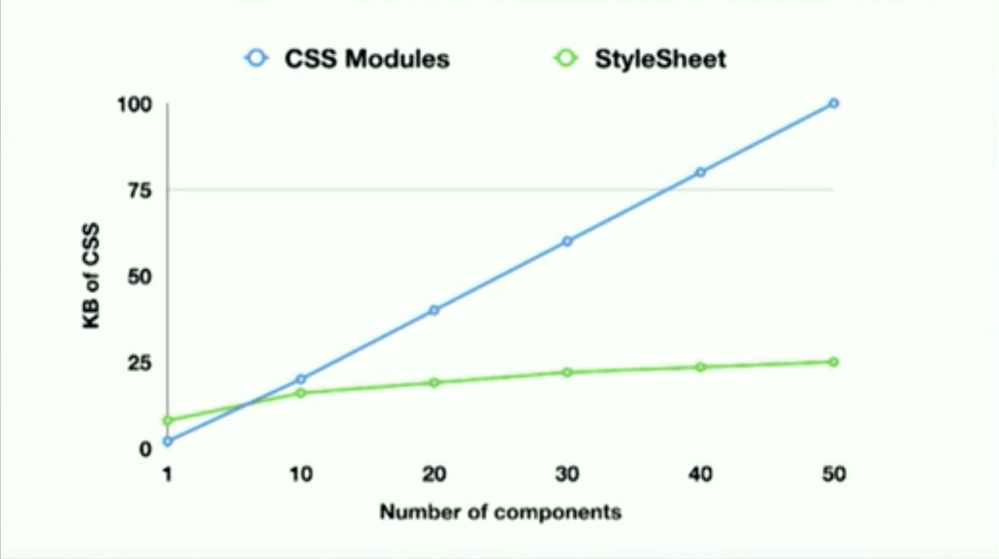
</div>

---

### React-Native-Web

- React-Native -> ReactDOM
- babel-plugin-react-native-web

```jsx
import { View, Text } from 'react-native';
```

becomes

```jsx
import { View, Text } from 'react-native-web';
```

---

### React-Native-Web

```jsx
export const View = (props) => (
        <div
                {...props}
                style={{
                        // override possible
                        flexDirection: 'column',

                        ...props.style,

                        // override not possible
                        display: 'flex',
                }}
        />
);

export const Text = (props) => <span {...props} />;
```

---

### Gatsby + React-Native-Web

Server-side rendering

```jsx
AppRegistry.registerComponent('App', () => App);
const { element, getStyleElement } = AppRegistry.getApplication('App', { initialProps });

// Render the app
const html = ReactDOMServer.renderToString(element);

// Extract critical CSS
const css = ReactDOMServer.renderToStaticMarkup(getStyleElement());

const document = `<!DOCTYPE html>
<html>
    <head>
        <style>${css}</style>
    </head>
    <body>${html}</body>
</html>`;
```

---

### Gatsby + React-Native-Web

```jsx
import React from 'react';
import { StyleSheet, TouchableOpacity, Text, View } from 'react-native';
import Link from 'gatsby-link';

const styles = StyleSheet.create({
        // ...
});

const IndexPage = () => (
        <View style={styles.box}>
                <Text style={styles.text}>Hi this is React-Native-Web rendered by Gatsby</Text>

                <TouchableOpacity style={styles.button} onPress={() => alert('it works')}>
                        <Text style={styles.buttonText}>Button</Text>
                </TouchableOpacity>

                <Link to="/page-2/">Go to page 2</Link>
        </View>
);
```

---

### Gatsby + React-Native-Web


---

### Gatsby + React-Native-Web

```jsx
import { TouchableOpacity, Text } from 'react-native';

export const MyRNButton = () => (
        <TouchableOpacity
                onPress={() => alert('onPress')}
                style={{
                        padding: 10,
                        backgroundColor: 'blue',
                        borderRadius: 5,
                }}
        >
                <Text style={{ color: 'white' }}>Click me</Text>
        </TouchableOpacity>
);
```

- React-Native only
- Cross-platform

---

### Gatsby + React-Native-Web

```jsx
import React from 'react';
import { Link } from 'gatsby';
import { View, Text } from 'react-native';
import { MyRNButton } from './components';

const MyGatsbyPage = () => (
        <div>
                <h1>Gatsby page title</h1>
                <View>
                        <Text>Some RN text</Text>
                </View>
                <MyRNButton />
                <Link to="/nextGatsbyPage">Next</Link>
        </div>
);
```

- React-Native + React-DOM
- Not cross-platform

---

### MDX

- React in Markdown
- WIP: Vue, Svelte...

```mdx
# Hello world!

I can import and use React components:

import MyComponent from './myComponent';

<MyComponent age={42}>
```

---

### Gatsby + React-Native-Web + MDX

```mdx
# Blog title

blabla this is a MDX blog post using an embedded RN button:

import { MyRNButton } from './components';

<MyRNButton onPress={() => alert("pressed")}>
      Click me
</MyRNButton/>
```

```jsx
import React from 'react';
import MyMDXComponent from './myMDXFile.mdx';

const MyGatsbyPage = () => (
        <div>
                <h1>Gatsby page using a MDX component</h1>
                <MyMDXComponent />
        </div>
);
```

---

### Gatsby + React-Native-Web + MDX


---

### Limits

- No .web.js extension
- No TypeScript
- No RN lib transpilation
- No `__DEV__`
- No Expo
- ...

Need more Webpack config!

---

### Expo


- Best React-Native DX
- React-Native: lean core
- Expo: "extends" React-Native core
- More APIs: video, audio, file system...
- Partial web support

---

### Gatsby + Expo

- [@expo/webpack-config](https://www.npmjs.com/package/@expo/webpack-config)

```jsx
import { withUnimodules } from '@expo/webpack-config/addons';

export const onCreateWebpackConfig = ({ actions, getConfig }) => {
        const gatsbyConfig = getConfig();

        const gatsbyConfigWithExpo = withUnimodules(gatsbyConfig);

        actions.replaceWebpackConfig(gatsbyConfigWithExpo);
};
```

- Gatsby, NextJS, Create-React-App, Electron...
- Thank you [Evan Bacon](https://twitter.com/Baconbrix)

---

### Gatsby + Expo + MDX

```mdx
# A React-Native video in my blog post

Hey, look at my Expo video:

import { Video } from 'expo-av';

<Video
        source={{ uri: 'https://someDomain/video.mp4' }}
        rate={1.0}
        isMuted={true}
        resizeMode="cover"
        shouldPlay={true}
        isLooping={true}
        style={{ width: 280 }}
/>
```

---

### Gatsby + Expo + MDX


---


---


---


---

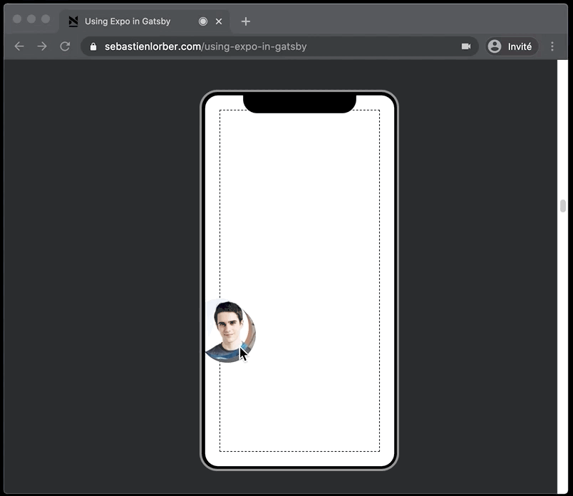

---


---

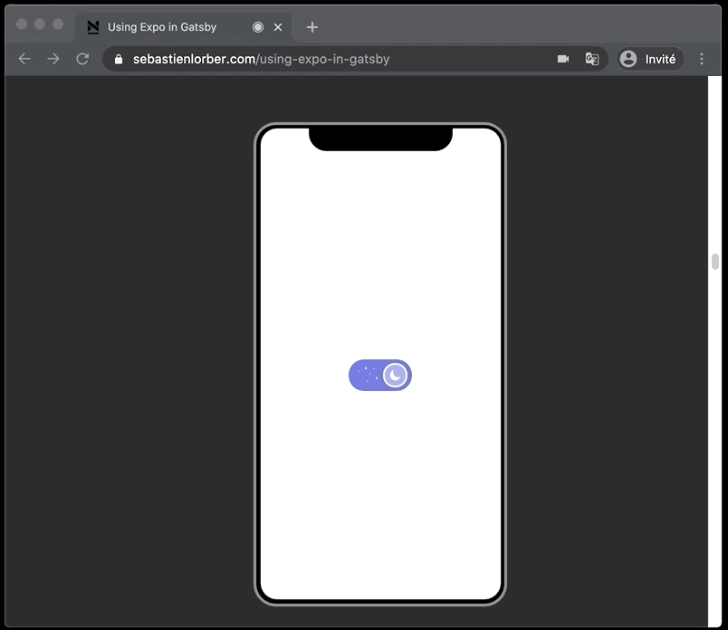

---


---

### React-Native + MDX

Step 1: source file

```mdx
# title

some text

import { MyComponent } from './components';

<MyComponent answer={42} />
```

---

### React-Native + MDX

Step 2: MDX -> JSX (MDX compiler)

```jsx
import { MyComponent } from './components';

export const MDXComponent = () => (
        <div>
                <h1>title</h1>
                <p>some text</p>
                <MyComponent answer={42} />
        </div>
);
```

---

### React-Native + MDX

Step 3: JSX -> JS ([babel-plugin-transform-react-jsx](https://babeljs.io/docs/en/babel-plugin-transform-react-jsx))

```jsx
import React from 'react';
import { MyComponent } from './components';

export const MDXComponent = React.createElement('div', {
        children: [
                React.createElement('h1', undefined, (children: 'title')),
                React.createElement('p', undefined, (children: 'some text')),
                React.createElement(MyComponent, { answer: 42 }, undefined),
        ],
});
```

---

### React-Native + MDX

Problem:

- React-DOM: div, h1, p...
- Run on React-Native?

Solution:

- JSX Pragma
- [MDXProvider](https://mdxjs.com/advanced/components#mdxprovider): override React-DOM components

---

### JSX Pragma

Comment: replace `React.createElement()`

```jsx
/** @jsx jsx */
import { jsx } from '@mdx-js/react';

import React from 'react';
import { MyComponent } from './components';

export const MDXComponent = () => (
        <div>
                <h1>title</h1>
                <p>some text</p>
                <MyComponent answer={42} />
        </div>
);
```

---

### JSX Pragma

After Babel

```jsx
import { jsx } from '@mdx-js/react';
import React from 'react';
import { MyComponent } from './components';

export const MDXComponent = jsx('div', {
        children: [
                jsx('h1', undefined, (children: 'title')),
                jsx('p', undefined, (children: 'some text')),
                jsx(MyComponent, { answer: 42 }, undefined),
        ],
});
```

---

### MDXProvider

```jsx
import React from 'react';
import { MDXProvider } from '@mdx-js/react';
import { View, Text, Linking } from 'react-native';

const Div = (props) => <View>{props.children}</View>;

const P = (props) => <Text>{props.children}</Text>;

const A = (props) => (
        <Text accessibilityRole="link" onPress={() => Linking.openUrl(props.href)}>
                {props.children}
        </View>
);

export const ReactNativeMDXProvider = ({ children }) => (
        <MDXProvider components={{ div: Div, p: P, a: A }}>{children}</MDXProvider>
);
```

Override DOM components by React-Native implementations

---

### MDXProvider + JSX Pragma

```jsx
import { jsx } from '@mdx-js/react';
import React from 'react';
import { MyComponent } from './components';

export const MDXComponent = jsx('div', {
        children: [
                jsx('h1', undefined, (children: 'title')),
                jsx('p', undefined, (children: 'some text')),
                jsx(MyComponent, { answer: 42 }, undefined),
        ],
});
```

```jsx
import { MDXComponent } from './my-blog-post';

const App = () => (
        <ReactNativeMDXProvider>
                <MDXComponent />
        </ReactNativeMDXProvider>
);
```

---

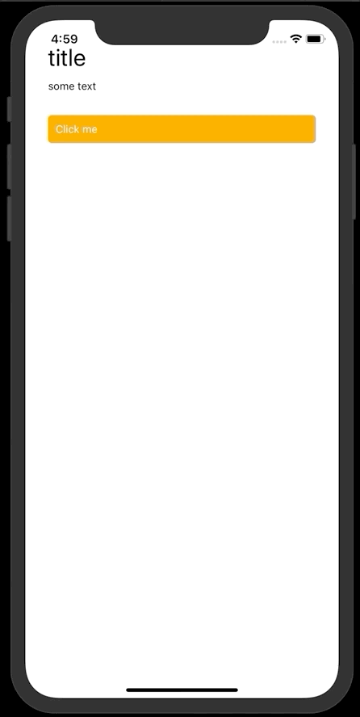

---

<div style={{ display: 'flex', alignSelf: 'center' }}>
        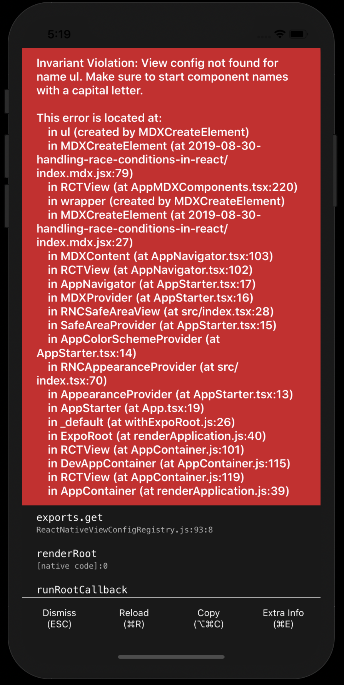
        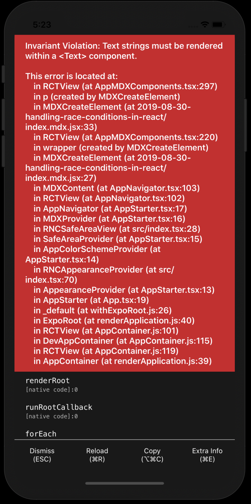
</div>

---

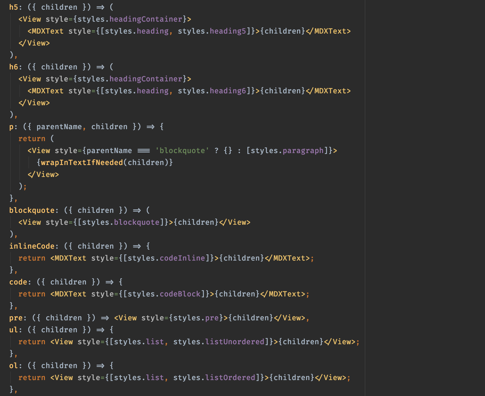

---

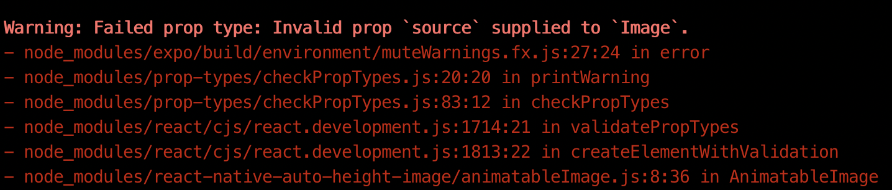

```jsx
 src: require('./myImage.png'),
                src: './myImage.png',
                alt: null,
        }}
/>
```

```jsx
// hacky solution, TODO use Remark
const imageSrcToRequire = (jsx) => {
        const regexp = /"src": ?("(\\"|[^"])*\.(jpg|jpeg|png)")/g;

        return jsx.replace(regexp, function (match, attribute, value) {
                return `"${attribute}": require(${value})`;
        });
};
```

---

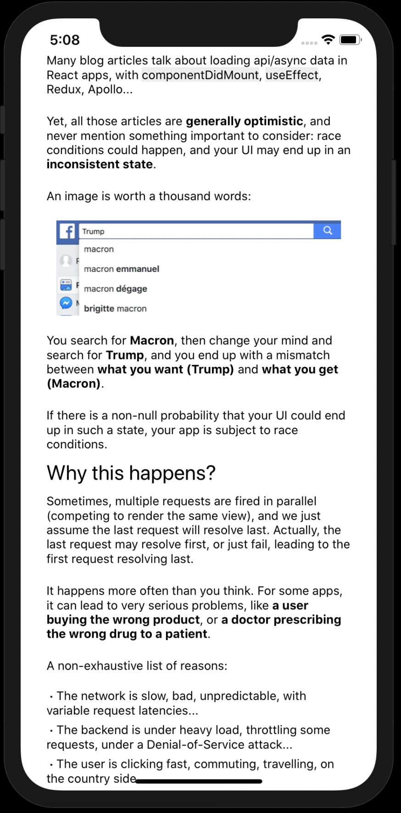

---

```jsx
import React from 'react';
import { ScrollView, Image, Text } from 'react-native';
import { MDXComponent, frontMatter } from './my-blog-post';

const App = () => (
        <ScrollView>
                <Image source={frontmatter.hero} />

                <Text>{frontmatter.title}</Text>

                <ReactNativeMDXProvider>
                        <MDXComponent />
                </ReactNativeMDXProvider>
        </ScrollView>
);
```

---


---

### Static mobile app generator

Step 1: compile MDX -> JSX

```jsx
// in: ./content/posts/my-super-post.mdx
// out: ./content/posts/my-super-post.mdx.jsx
function toJSXFile(mdxFile) {
        const mdxString = fs.readFileSync(mdxFile);
        const jsxString = toJSXString(mdxString);

        const jsxFile = mdxFile + '.jsx';
        fs.writeFileSync(jsxFile, jsxString);

        return jsxFile;
}

const jsxFiles = glob.sync('./content/**/*.mdx').map(toJSXFile);
```

---

```jsx
const fs = require('fs');
const mdx = require('@mdx-js/mdx');
const glob = require('glob');
const grayMatter = require('gray-matter');

const toJSXString = (mdxString) => {
        // Extract frontmatter
        const { data, content } = grayMatter(mdxString);

        const pragmaString = `/* @jsx mdx */
                        import { mdx } from '@mdx-js/react';`;

        // Compile MDX to JSX
        const jsxString = mdx.sync(content);

        const frontmatterString = `export const frontmatter = ${JSON.stringify(data)};`;

        return `
                ${pragmaString}
                ${jsxString}
                ${frontmatterString}
                `;
};
```

---

Step 2: generate list of blog posts

```jsx
// export default [
//   require("./content/posts/my-super-post.mdx.jsx"),
//   require("./content/posts/another-post.mdx.jsx")
// ]

fs.writeFileSync(
        './blogPostList.js',
        `export default [${jsxFiles.map((jsxFile) => `require('${jsxFile}')`).join(',\n')}]`,
);
```

---

Step 3: create mobile app entry

```jsx
const AppNavigator = () => (
        <Stack.Navigator>
                <Stack.Screen name="BlogPostList" component={BlogPostListScreen} />
                <Stack.Screen
                        name="BlogPost"
                        component={BlogPostScreen}
                        options={({ route }) => ({
                                title: route.params.blogPost.frontmatter.title,
                        })}
                />
        </Stack.Navigator>
);

const App = () => (
        <ReactNativeMDXProvider>
                <NavigationContainer>
                        <AppNavigator />
                </NavigationContainer>
        </ReactNativeMDXProvider>
);
```

---

Step 4: BlogPostList screen

```jsx
// generated file
import BlogPostList from './blogPostList';

const BlogPostListScreen = () => {
        const navigation = useNavigation();
        return (
                <ScrollView>
                        {BlogPostList.map((blogPost, i) => (
                                <BlogPostCard
                                        blogPost={blogPost}
                                        key={i}
                                        onPress={() =>
                                                navigation.navigate('BlogPost', { blogPost })
                                        }
                                />
                        ))}
                </ScrollView>
        );
};
```

---

Step 5: BlogPost screen

```jsx
const BlogPostScreen = ({ blogPost }) => {
        const { MDXComponent, frontmatter } = blogPost;
        const navigation = useNavigation();

        return (
                <ScrollView>
                        <BlogPostHeader
                                frontmatter={frontmatter}
                                onBackPress={() => navigation.goBack()}
                        />
                        <MDXComponent />
                </ScrollView>
        );
};
```

---


---


---


---

# CI Automation

```json
{
        "scripts": {
                "expo:publish": "yarn compileMdx && expo publish",
                "gatsby:build": "gatsby build"
        }
}
```

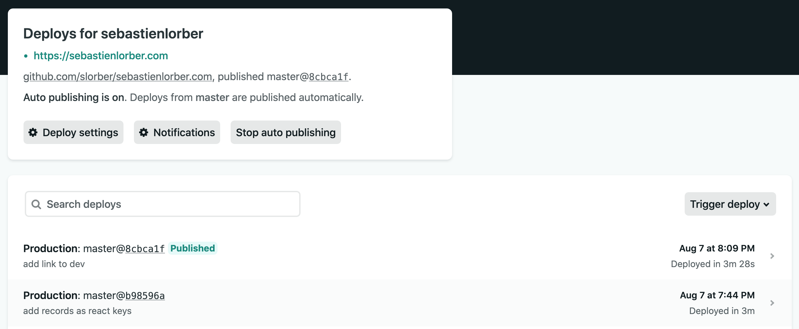

---

# CI Automation

On commit:

- Deploy Gatsby on Netlify
- Publish Expo on branch release channel

...quite nice, but...

- `expo build:web` ?
- React-Navigation web support?
- 🧐 🤓 🤭

---

# CI Automation

3 platforms: web, mobile, mobile web

```json
{
        "scripts": {
                "netlify:web": "gatsby build",
                "netlify:mobile": "expo publish && expo build:web"
        }
}
```

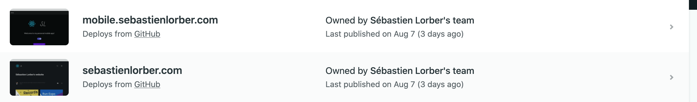

---


---


---

# All the platforms

- iOS
- Android
- Web
- MacOS ?
- Windows ?
- 🤪 🤪 🤪

---


---

# All the platforms

- React-Native MacOS Tray app (menu bar)

- Native, no WebView

- Windows: less lucky

- Not enough time

---

# Thank you

- Links: [sebastienlorber.com/RNEU2020](https://sebastienlorber.com/RNEU2020)
- Twitter: [@sebastienlorber](https://twitter.com/sebastienlorber)
- Call-to-Action: adopt cross-platform 🙏🙏🙏

<div
        style={{
                flex: 1,
                flexDirection: 'column',
                display: 'flex',
                alignItems: 'center',
                justifyContent: 'center',
        }}
>
        <div style={{ display: 'flex' }}>
                
                <div
                        style={{
                                margin: 20,
                                padding: 10,
                                backgroundColor: 'white',
                        }}
                >
                        
                </div>
        </div>
</div>
